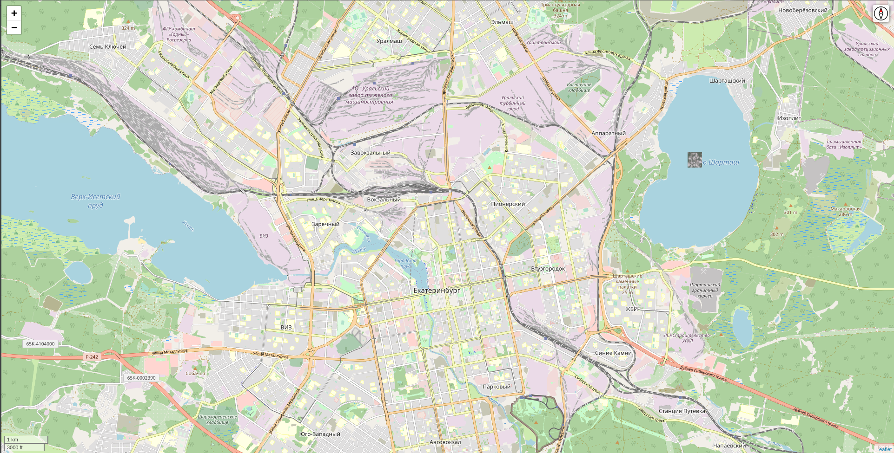

**Приложение для Кванториада 2021**

Само приложение представляет из себя web-сайт на базе python-Django. На данном сайте будут отображаться изображения сделанные дроном.
Для корректной работы приложения необходимо установить Django командой `pip install django` затем перейти в папку `app` с файлом `manage.py`и прописать команду `python manage.py runserver` по умолчанию приложение откроется `http://127.0.0.1:8000/`.
Приложение будет выглядеть следующим образом: 
В папке `river` находятся скрипты для дрона их необходимо запускать на Raspberry Pi с установленным `python3` и PiCamera, также требуются такие библиотеки как Pillow, Opencv, Numpy, PiCamera. Основным скриптом является `drone.py`